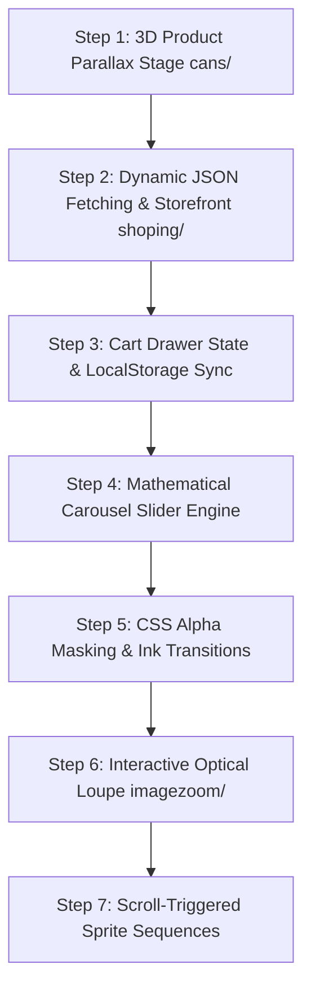

# Step-by-Step Rebuild Guide: DevSprint Motion Lab

```mermaid
flowchart TD
    S1[Step 1: 3D Product Parallax Stage cans/] --> S2[Step 2: Dynamic JSON Fetching & Storefront shoping/]
    S2 --> S3[Step 3: Cart Drawer State & LocalStorage Sync]
    S3 --> S4[Step 4: Mathematical Carousel Slider Engine]
    S4 --> S5[Step 5: CSS Alpha Masking & Ink Transitions]
    S5 --> S6[Step 6: Interactive Optical Loupe imagezoom/]
    S6 --> S7[Step 7: Scroll-Triggered Sprite Sequences]
```
